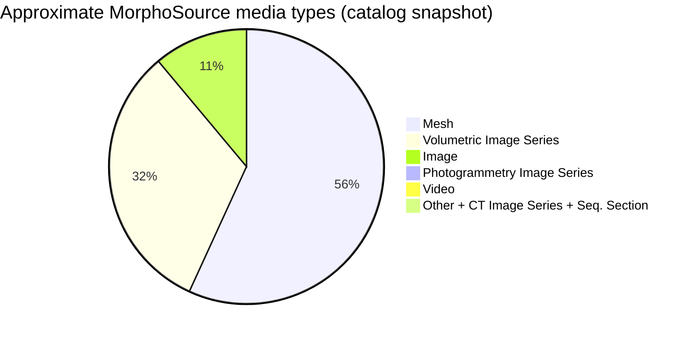
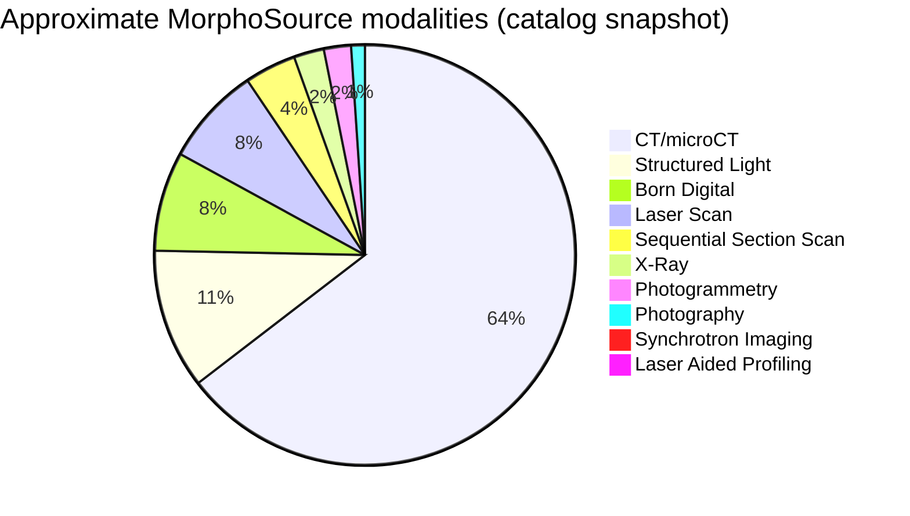
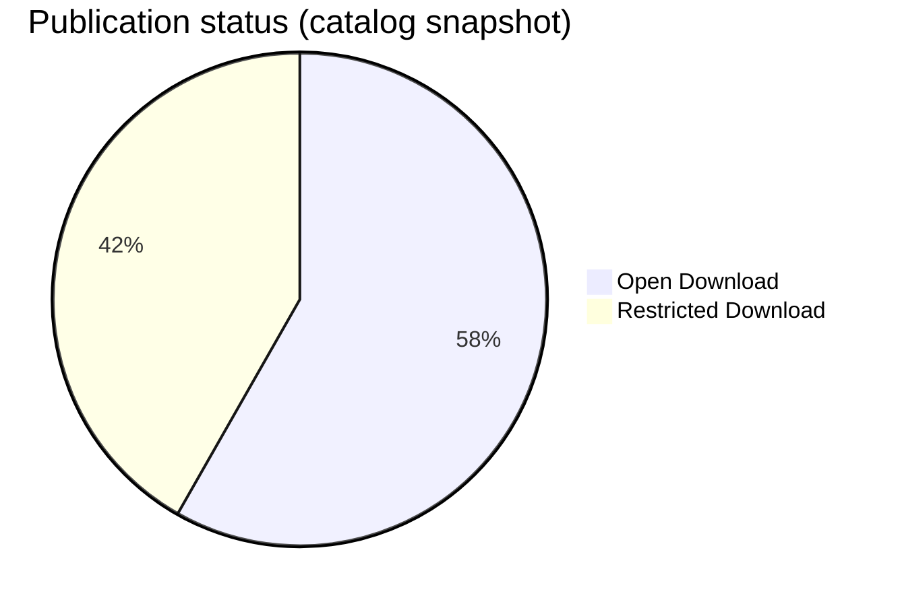
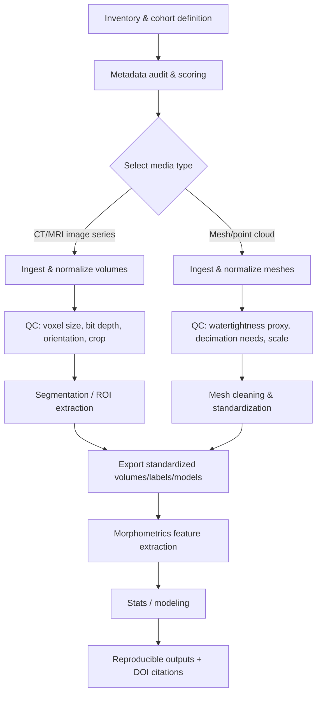
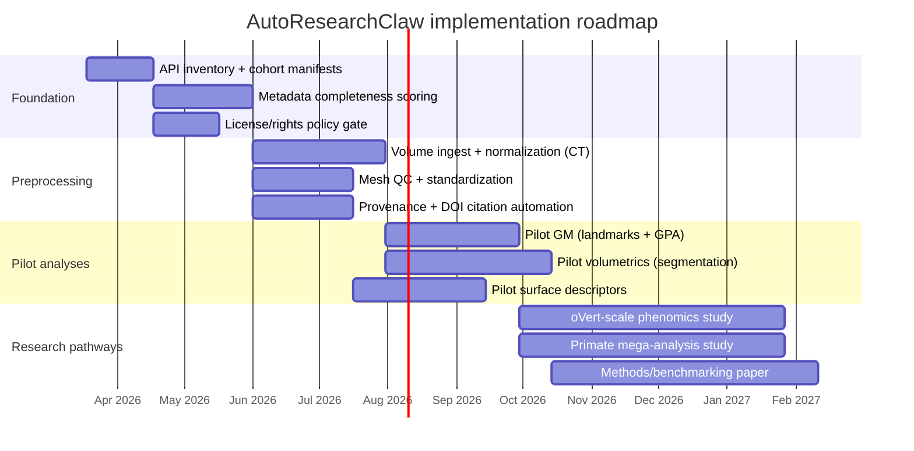

# Analyzing MorphoSource Data and Proposing Research Pathways for AutoResearchClaw

## Executive summary

MorphoSource is a large, disciplinary repository for 3D/2D media representing primarily museum and research specimens, with a governance and metadata model designed explicitly for complex imaging workflows, reuse restrictions, and persistent identifiers (e.g., DOI/ARK). citeturn28view0turn28view3

Repository scale is large enough that “AutoResearchClaw” should be designed around automated discovery, structured metadata auditing, and reproducible preprocessing/analysis at scale. As of a re3data.org registry update dated 2025-09-15, MorphoSource reported **186,369 media files**, **65,004 physical objects**, and **1,980 data projects** (plus large counts of GBIF-linked and user-created taxonomies). citeturn28view3

A public MorphoSource media-catalog snapshot (retrieved from the site UI in 2024) provides a useful *approximate* breakdown by media type, modality, object type, project, and licensing; it indicates that meshes and CT/microCT-derived content dominate, and that “Open Download” and “Restricted Download” both represent substantial shares. Because this snapshot predates the 2025 repository-size update above, the *absolute* counts are likely outdated, but the distribution is still informative for planning. citeturn15view0turn28view3

High-quality “research-ready” MorphoSource datasets (i.e., those with strong technical validation and detailed metadata expectations) are often described in peer-reviewed “data descriptor” papers. Examples spanning different modalities and analysis opportunities include: a >6,000-media multi-institution primate phenotype collection; a microCT primate cranial/postcranial dataset with explicit per-scan voxel size and scan settings; a Duke Lemur Center microCT collection with reported scanner error <0.3%; an oVert vertebrate imaging network built around ensuring comparability and dissemination via MorphoSource; and a chimpanzee radiological growth image series. citeturn25search0turn31view0turn29search5turn30search1turn30search0

Technically, MorphoSource exposes a REST API that can support robust inventory and auditing. Critical design constraints for AutoResearchClaw include: (a) downloads require an API key and explicit use-intent statements/categories; (b) “published” metadata queries can be done without a key, but private/restricted access requires authorization; and (c) rich file/mesh metadata (point/face counts, bounding boxes, pixel spacing, etc.) are available via API schemas and dedicated endpoints—ideal for automated QC and usability scoring. citeturn7view0turn6view0turn7view1

Three prioritized research pathways emerge as broadly valuable when taxonomic scope and goals are initially unspecified: (1) cross-taxon CT-driven skeletal macroevolution and disparity studies anchored on oVert-scale vertebrate sampling; (2) primate-focused shape, allometry, and integration studies using “Primate Phenotypes” plus microCT primate datasets with explicit voxel/scan settings; and (3) methods/benchmarking research to quantify effects of modality/device/resolution on downstream morphometrics, leveraging datasets that explicitly report multi-device harmonization and scanner error studies. citeturn30search1turn25search0turn31view0turn29search5

## MorphoSource landscape and dataset inventory

### What constitutes a “dataset” in MorphoSource

For practical research operations, the most actionable “dataset” containers on MorphoSource are **Projects/Teams** (curated sets of media) and **Media** records linked to **Physical Objects** (specimens or cultural heritage objects). The public API explicitly supports searching media records and retrieving project- or team-associated media, as well as retrieving physical-object records. citeturn7view0turn7view2

MorphoSource’s design intent—supporting archiving, discovery, and reuse of 3D specimen data with attention to file formats and metadata best practices—has been described in detail by entity["people","Doug M. Boyer","evolutionary anthropologist"] and colleagues, including discussion of governance, “bit rot”/format obsolescence concerns, and stakeholder rights vs. accessibility. citeturn28view0

### Repository-scale inventory

**Repository size (2025-09-15 update):** 186,369 media files; 65,004 physical objects; 1,980 data projects (plus thousands of users/contributors and large taxonomic-normalization counts). citeturn28view3

**Repository standards and identifiers:** re3data lists Darwin Core and Dublin Core among metadata standards, indicates DOI and ARK identifier systems, and identifies MorphoSource as exposing a REST API. citeturn28view3

### Approximate composition from the public media-catalog snapshot

The MorphoSource media-catalog UI snapshot (retrieved from the MorphoSource site interface in 2024) showed 158,482 media results at that time. citeturn15view0

From that same snapshot, the top-level distributions were approximately:

- **Media type:** Mesh (88,936), Volumetric Image Series (50,202), Image (17,346), smaller counts for photogrammetry image series, video, and sequential-section series. citeturn15view0  
- **Modality:** X-Ray CT/microCT (101,460) dominates, followed by Structured Light (16,908), Born Digital (12,010), Laser Scan (11,949), Sequential Section Scan (6,222), Photogrammetry (3,280), and others. citeturn15view0  
- **Object type:** Biological specimen (157,089) far exceeds cultural heritage object (1,313). citeturn15view0  
- **Publication status:** Open Download (92,292) vs Restricted Download (66,190). citeturn15view0  
- **CC licenses and rights statements:** CC BY‑NC and related licenses appear frequently, with a range of rightsstatements.org categories (e.g., “In Copyright”, “Copyright Undetermined”). citeturn15view0  

These counts are useful for **planning** and for specifying AutoResearchClaw’s default sampling strategy, but the absolute values should be treated as time-stamped (2024 UI snapshot) rather than current, because re3data reports larger totals in 2025. citeturn15view0turn28view3

### Research-ready dataset inventory anchored to primary publications

Because taxonomic scope is unspecified, the highest-return strategy is to prioritize datasets that are (a) large enough for scalable methods, (b) explicitly validated/benchmarked, and (c) have clear data-format and metadata expectations described in primary literature.

The following inventory is designed as an initial “portfolio” for AutoResearchClaw (covering CT volumes, meshes, and 2D radiographs):

| Dataset / primary descriptor source | Approx. taxonomic scope | Media scale | Imaging modality emphasis | Notes relevant to analysis readiness |
|---|---|---:|---|---|
| “Primate Phenotypes” (Scientific Data 2024) with MorphoSource Project ID 00000C706 | Primates across major clades (non-human hominoids emphasized; other anthropoids, some non-anthropoids) | >6,000 media; paper states 6,192 | microCT, medical CT, structured light (and other surface workflows) | Authors report technical validation that meshes created across diverse devices can be combined for comparable morphometrics; meshes as PLY; CT as DICOM or TIFF stacks; metadata in MorphoSource includes technical fields like mesh point count and CT pixel dimensions. citeturn25search0 |
| MicroCT non-human primate scans (Scientific Data 2016; PMC full text) | Broad primate family coverage | 489 scans from 431 specimens; 59 species | microCT image stacks | Paper includes a per-record table with DOI, file size, taxonomy, voxel size (x/y/z resolution) and scan parameters (kV, amperage, watts, projections), enabling unusually strong scan-parameter controls. citeturn31view0 |
| Duke Lemur Center microCT digital collection (PLoS ONE 2019; DOAJ record) | Strepsirrhines (lemurs + other primates in DLC holdings) | >100 cadavers; 18 species | microCT | Includes both overviews and targeted high-resolution scans; reports <0.3% error across multiple resolution levels; emphasizes rich life-history information for captive/free-ranging individuals (valuable for phenotype covariates). citeturn29search5turn29search8 |
| openVertebrate (oVert) network (BioScience 2024) | Broad vertebrate diversity | >29,000 media for >13,000 specimens (as of Nov 2023) | CT + contrast-enhanced CT (diceCT) and some surface scanning via partner projects | Explicitly discusses cross-institution best practices for comparability, and that data are deposited in MorphoSource; highlights challenges spanning resolution limits of medical scanners and scaling to large files; emphasizes analysis bottlenecks and need for new tools—directly aligned with AutoResearchClaw’s purpose. citeturn30search1 |
| Nissen–Riesen chimp radiological growth series (Wiley 2020; PubMed record) | Chimpanzee (growth-series radiographs) | 3,568 X-ray images | 2D radiographs | Enables longitudinal/ontogenetic and developmental timing research; complements 3D morphometrics with image-based growth metrics and skeletal maturation models. citeturn30search0 |

Institutional/museum collaborators implicit in these datasets include major specimen-holding organizations such as entity["organization","American Museum of Natural History","New York, NY, US"], entity["organization","National Museum of Natural History","Smithsonian | Washington, DC, US"], entity["organization","Royal Museum for Central Africa","Tervuren, Belgium"], entity["organization","Cleveland Museum of Natural History","Cleveland, OH, US"], entity["organization","Stony Brook University","Stony Brook, NY, US"], entity["organization","Harvard University","Cambridge, MA, US"], entity["organization","Museum of Comparative Zoology","Harvard | Cambridge, MA, US"], entity["organization","Duke Lemur Center","Durham, NC, US"], and entity["organization","Florida Museum of Natural History","Gainesville, FL, US"]. citeturn25search0turn31view0turn29search8turn30search1

### Dataset-composition charts from the MorphoSource media-catalog snapshot

The following charts are derived from the 2024 MorphoSource media-catalog facet counts (useful for planning; not guaranteed current). citeturn15view0turn28view3

## Metadata quality and completeness framework

### Field-level mapping: what to check and where it lives

Your target audit fields—specimen ID, taxonomy, locality, date, imaging modality, resolution, scan parameters, licensing—map well to MorphoSource’s metadata architecture, which combines controlled vocabularies and established standards (e.g., Darwin Core terms for specimen identifiers and locality). citeturn28view3turn13view0

A practical mapping for AutoResearchClaw’s metadata audit is:

- **Specimen identifier**: Darwin Core triplet (institution/collection/catalog) and/or occurrence IDs. In the MorphoSource API schema for physical objects, the “title” field is explicitly described as a Darwin Core triplet for biological specimens, and physical-object records include institution_code, collection_code, and catalog_number. citeturn6view1turn6view2  
- **Taxonomy**: taxonomy_name plus taxonomy_gbif-linked names appear in the physical-object schema and are emphasized as integrated/updated via aggregators such as entity["organization","iDigBio","specimen data aggregator"] and entity["organization","Global Biodiversity Information Facility","biodiversity data network"] in dataset descriptor literature. citeturn6view1turn25search0  
- **Locality**: MorphoSource’s terms vocabulary explicitly includes Darwin Core locality concepts (country, stateProvince, locality) and guidance about uncertainty/multiplicity. citeturn13view0  
- **Date**: MorphoSource provides date_uploaded and date_modified in multiple schemas; “date collected” may be in specimen records (when available) but should be treated as optional and sometimes absent for legacy museum material. citeturn6view0turn6view2  
- **Imaging modality**: controlled vocabulary “Image Modality” (e.g., CT/microCT, photogrammetry) and fields such as f.modality in API search are explicit; the media catalog similarly facets on modality. citeturn7view2turn13view0turn14view1turn15view0  
- **Resolution / voxel size**: the MorphoSource API media schema includes x/y/z pixel spacing and a unit field, and file-metadata includes image dimensions/bit depth/compression-type fields; some datasets additionally provide scan tables with per-record voxel size. citeturn5view2turn6view0turn31view0  
- **Scan parameters**: some projects store DICOM-like acquisition fields (e.g., KVP/exposure) in metadata; at least one major microCT dataset provides kV and projections in a downloadable scan table keyed to MorphoSource DOIs, indicating strong “scan paradata” availability in practice. citeturn13view0turn31view0  
- **Licensing and reuse restrictions**: MorphoSource uses both rightsstatements.org URIs and Creative Commons license URIs (and histories of “open/restricted/private” visibility). Licensing and rights-statement filters are explicitly supported in the media-search API, and were visible as major facets in the public media catalog snapshot. citeturn7view2turn15view0turn13view0  

### A completeness scoring model that can work across unknown taxa and goals

Because initial goals are unspecified, AutoResearchClaw should compute a **metadata completeness score** at three nested levels, each of which can be used as a filter during dataset selection:

1. **Specimen-level completeness** (physical object): specimen identifier present; taxonomy present and resolved; locality fields present (when expected); sex/age/life-history covariates where applicable. citeturn6view1turn13view0turn29search8  
2. **Media-level completeness** (imaging record): modality present; element/part present; resolution fields present (pixel spacing or comparable); device/facility recorded; date_uploaded present. citeturn7view2turn6view0turn15view0  
3. **File-level completeness** (download bundle): filename(s) and mime types; mesh point/face counts (for meshes); image-stack characteristics (rows/columns, bits allocated, compression); plus any “contents accepted file count” for zip bundles (especially CT stacks). citeturn6view0turn6view1  

This tiering matches what the public API describes as separate endpoints/schemas (media, physical objects, and media file metadata). citeturn7view0turn6view0

### Comparative metadata completeness across exemplar MorphoSource datasets

The table below provides a *research planning* view of expected metadata coverage across the exemplar datasets above (grounded in their primary publications and MorphoSource’s schema/vocabulary). When a field is marked “Strong,” it is explicitly reported as present/controlled in the dataset descriptor or in a per-scan table; “Likely” indicates the field is part of MorphoSource’s model but not explicitly verified in the cited descriptor text; “Variable” indicates known heterogeneity or dependence on specimen-source records.

| Dataset (primary source) | Specimen ID | Taxonomy | Locality | Date | Modality | Resolution | Scan parameters | Licensing/rights |
|---|---|---|---|---|---|---|---|---|
| Primate Phenotypes (Scientific Data 2024) | Strong (vouchered; MorphoSource project context) citeturn25search0 | Strong; integrated taxonomic updates discussed citeturn25search0 | Variable (depends on museum records; not guaranteed in descriptor) citeturn25search0turn13view0 | Strong (date uploaded/records; MorphoSource metadata emphasized) citeturn25search0turn6view0 | Strong (CT + structured light + others described) citeturn25search0turn14view1 | Strong (resolution + mesh point count etc claimed available in MorphoSource metadata) citeturn25search0turn6view0 | Variable (prior studies for CT protocols; per-media settings in MorphoSource) citeturn25search0 | Strong (open availability; MorphoSource licensing model) citeturn25search0turn7view2 |
| MicroCT primate dataset (Scientific Data 2016; PMC) | Strong (per-record DOIs + specimen labels) citeturn31view0 | Strong (taxonomy in Table 1) citeturn31view0 | Variable (not central in Table 1; Darwin Core locality exists but depends on source) citeturn13view0turn31view0 | Strong (recorded; MorphoSource dates exist) citeturn6view0turn31view0 | Strong (microCT) citeturn31view0turn14view1 | Strong (x/y/z voxel size in Table 1) citeturn31view0 | Strong (kV, amperage/watts, projections in Table 1) citeturn31view0 | Strong (explicit licensing/credit instructions in Table 1; MorphoSource licenses modeled) citeturn31view0turn7view2 |
| Duke Lemur Center microCT collection (PLoS ONE 2019; DOAJ/PubMed) | Strong (specimens in DLC holdings) citeturn29search8 | Strong (18 species stated) citeturn29search8 | Variable (captivity context improves life history; geographic locality depends on records) citeturn29search8turn13view0 | Strong (scan set publication and MorphoSource date fields) citeturn29search8turn6view0 | Strong (microCT) citeturn29search8turn14view1 | Likely (multi-resolution study implies stored) citeturn29search8turn6view0 | Likely/Variable (scanner error quantified; per-scan settings likely recorded but not shown in abstract) citeturn29search8turn13view0 | Likely (MorphoSource licensing model applies) citeturn29search8turn7view2 |
| oVert (BioScience 2024) | Strong (specimen-driven digitization) citeturn30search1 | Strong (vertebrate diversity emphasis; taxonomy integration described) citeturn30search1turn25search0 | Variable (museum records heterogeneity; Darwin Core locality exists but completeness varies) citeturn13view0turn30search1 | Strong (repository tracking and MorphoSource usage tracking discussed) citeturn30search1turn7view0 | Strong (CT + diceCT, plus partner surface scanning) citeturn30search1turn14view1 | Variable (medical CT resolution limits described; microCT higher resolution also used) citeturn30search1 | Variable (cross-institution best practices; depends by site) citeturn30search1turn13view0 | Strong (motivated by broad access; uses MorphoSource rights tools) citeturn30search1turn7view2 |
| Nissen–Riesen chimp radiological growth series (Wiley 2020; PubMed) | Strong (individual-based growth series) citeturn30search0 | Strong (chimpanzee cohort) citeturn30search0 | N/A or Variable (radiography series may not emphasize collection locality) citeturn30search0turn13view0 | Strong (time-series imaging is intrinsic) citeturn30search0turn6view0 | Strong (X-ray radiographs) citeturn30search0turn14view1 | Variable (2D pixel resolution depends on digitization pipeline) citeturn30search0turn6view0 | Variable (radiography settings may not be preserved consistently) citeturn30search0turn13view0 | Likely (MorphoSource rights model applies; must be checked per record) citeturn7view2turn30search0 |

## 3D model usability and preprocessing pipeline

### Usability criteria for MorphoSource-derived 3D data

AutoResearchClaw should treat “usability” as **task-dependent** (e.g., landmarking vs. volumetrics vs. machine learning), but the following measurable properties are broadly critical:

**Meshes (surface models)**

- **File format(s):** prioritize non-proprietary mesh formats (e.g., PLY) when available; dataset descriptors explicitly note PLY as a standard format for large mesh collections. citeturn25search0turn14view1  
- **Mesh complexity and potential QC:** point count and face count are explicitly part of MorphoSource “media file metadata,” enabling automated thresholds (e.g., flagging extremely low poly meshes for high-precision landmarking). citeturn6view0  
- **Color/texture availability:** UV-space presence and vertex color are also part of file metadata; these matter for certain biological surfaces and for visualization workflows. citeturn6view0turn13view0  
- **Scene scale / bounding boxes:** bounding-box measures and centroids are part of file-level metadata, enabling sanity checks across datasets and detection of unit errors. citeturn6view0turn13view0  

**Volumes (CT image stacks / reconstructed volumes)**

- **Voxel size (x/y/z spacing + units):** MorphoSource API schemas include x/y/z pixel spacing and units; some high-quality datasets provide explicit voxel sizes per scan in tables linked to MorphoSource DOIs. citeturn5view2turn31view0  
- **Image-stack characteristics:** rows/columns, bits allocated/stored, and compression are part of file metadata, enabling automated comparability checks (e.g., 8-bit vs 16-bit). citeturn6view0turn13view0  
- **Scan paradata (when available):** for microCT datasets, acquisition parameters (e.g., kV, projections) can be present and explicitly tabulated, enabling more rigorous controls for downstream quantitative work. citeturn31view0turn13view0  

**Segmentation and landmarks**

- **Segmentations:** MorphoSource controlled vocabularies explicitly represent processing activity types including “Reconstructed Tomography to Mesh” (segmentation-derived meshes), supporting provenance-aware workflows. citeturn14view1turn13view0  
- **Landmarks:** Landmarks are often not first-class MorphoSource fields in public faceting; AutoResearchClaw should detect them as companion files (e.g., .fcsv) inside download bundles, using file metadata and mime types where available. citeturn6view0turn7view0  

### How AutoResearchClaw should access MorphoSource at scale

MorphoSource’s REST API supports: searching media records, retrieving individual records, getting file metadata, and requesting download URLs. Downloading requires a user API key plus a ≥50-character use-intent statement and category selection(s). citeturn7view0turn7view1

This access-control model is a central design requirement: AutoResearchClaw must log, store, and (when necessary) surface these use-intent artifacts in any audit trail, because they are part of compliant access. citeturn7view0turn7view1

### Recommended preprocessing pipeline

The pipeline below is designed to be (a) modality-agnostic, (b) provenance-aware, and (c) scalable across unknown taxa and research goals, while still producing research-grade outputs.

**Step-level tools and recommended outputs**

| Step | Purpose | Suggested tools | Expected outputs |
|---|---|---|---|
| Inventory & cohort definition | Build a “candidate pool” spanning modalities/taxa (or focused subsets once goals are set) | MorphoSource REST API search endpoints (media/projects/objects), plus project-level descriptors from primary literature citeturn7view2turn25search0turn30search1 | Cohort manifest (CSV/JSON) with MorphoSource IDs/DOIs, modality, object IDs, licenses |
| Metadata audit & scoring | Quantify completeness; filter for “analysis-ready” records | API media + physical-object queries; terms vocabulary for expected fields citeturn7view0turn6view2turn13view0 | Field presence matrix; completeness scores; exclusion reasons |
| Ingest & normalize volumes | Convert CT stacks to standard internal format; standardize orientation/spacing | 3D Slicer DICOM import and downstream volume handling documented in the DICOM module; export to NRRD where appropriate citeturn27search4turn27search0 | Standardized volumes (NRRD/NIfTI), provenance log, voxel-size checks |
| Segmentation / ROI extraction | Produce labelmaps and/or derived meshes for volumetrics and shape work | 3D Slicer Segmentations workflow (import/export segmentation and models) citeturn27search0 | Segmentation labelmaps (NRRD), surface models (STL/OBJ/other), quantitative measurements |
| Ingest & normalize meshes | Clean and standardize meshes for landmarking/surface metrics | Use MorphoSource file-metadata fields (vertex/face counts, bounding boxes) to drive automated QC and decimation decisions citeturn6view0turn13view0 | Standardized mesh set (e.g., PLY), QC report (counts, scale, bounding boxes) |
| Landmarking (if needed) | Create comparable landmark/semi-landmark sets | SlicerMorph is explicitly designed to support retrieval/visualization/analysis of 3D morphology in 3D Slicer citeturn27search6 | Landmark files (e.g., FCSV), templates, repeatability logs |
| Morphometrics feature extraction | Compute either landmark-based or surface/volume features | Landmark: geomorph’s gpagen (GPA) and downstream methods; volumetrics: 3D Slicer measurement exports citeturn27search2turn27search0 | PCA scores, Procrustes coordinates, volumes, derived traits tables |
| Stats / modeling | Hypothesis tests and prediction | Procrustes ANOVA/regression and allied methods in geomorph documentation; phylogenetic extensions as needed citeturn27search2turn27search1 | Model summaries, effect sizes, uncertainty estimates, plots |
| Reproducible outputs + DOI citations | Citation-complete research artifacts | Enforce DOI capture per scan; dataset descriptor papers emphasize listing DOIs for used scans to enable tracking citeturn31view0turn25search0 | Manuscript-ready results with DOI tables; full provenance trail |

## Morphometric analysis options and expected outputs

This section outlines “sample quantitative morphometric analyses options” that remain valid even before the taxonomic scope or biological question is specified, because they are modular and can be run on both narrow and broad cohorts.

### Landmark-based geometric morphometrics

**Core workflow:** (1) define landmark configuration; (2) perform Generalized Procrustes Analysis (GPA) with optional curve/surface semilandmarks; (3) analyze shape variation and covariates (size, ecology, phylogeny, sex); (4) quantify disparity/integration/modularity depending on the question.

A practical backbone for GPA is geomorph’s `gpagen`, which explicitly supports fixed landmarks plus curve and surface semilandmarks and outputs Procrustes-aligned coordinates suitable for PCA and regression. citeturn27search2turn27search1

**Expected outputs (typical):**
- Procrustes shape variables (aligned coordinates)  
- Centroid size (size covariate)  
- PCA (shape space) scores and loadings, plus shape-change visualizations  
- Procrustes regression / ANOVA models (group differences; allometry)  

These outputs are directly aligned with the design goal of large-scale phenomics datasets on MorphoSource (e.g., Primate Phenotypes) and with the need to overcome “analysis bottlenecks” described for oVert-scale projects. citeturn25search0turn30search1

### Surface-based metrics and mesh-derived phenotypes

Surface-based analyses are attractive when (a) landmarking is cumbersome or subjective at scale, or (b) the research question targets local surface properties (e.g., curvature, roughness), not just homologous landmarks.

**AutoResearchClaw’s key enabling feature** is that MorphoSource file metadata includes mesh point and face counts, UV-space presence, vertex color, and bounding-box dimensions—so the system can automatically stratify meshes by expected quality and comparability before running compute-heavy descriptors. citeturn6view0turn13view0

**Typical outputs (examples):**
- Global metrics: surface area, enclosed volume (if watertight), compactness proxies  
- Local metrics: curvature distributions and patch-based summaries  
- Spectral/shape descriptors: eigenvalue-based shape signatures (useful for retrieval or ML baselines)  

Dataset descriptor work emphasizes that MorphoSource-hosted meshes can be combined across devices when technical validation is performed—supporting the rationale for cross-device mesh descriptor comparisons. citeturn25search0

### Volumetrics and ROI-based quantitative anatomy

For CT/diceCT and other volumetric modalities, volumetrics is often the most direct “first quantitative readout”: organ volumes, bone volumes, thickness proxies, density distributions (where calibrated), and morphological ratios.

3D Slicer’s Segmentations module documents end-to-end workflows to import segmentations, create labelmap representations, and export segmentations to model files (STL/OBJ) or labelmap volumes (NRRD), explicitly noting the memory/compute implications of resolution choices. citeturn27search0

**Expected outputs (typical):**
- ROI volumes and related scalar measurements  
- Exported labelmaps + derived surface models  
- QC artifacts: segmentation geometry, smoothing/oversampling parameters, provenance  

oVert’s primary paper highlights diceCT and CT-derived tomograms as a route to soft-tissue anatomy (muscles, nervous system, cardiovascular system, etc.) and flags resolution and scale challenges—making automated volumetric pipelines a high-value target for AutoResearchClaw. citeturn30search1

## Research questions and hypotheses enabled

Because taxonomic scope and research goals are unspecified, the most robust way to propose hypotheses is to frame them as **families of questions** that can be instantiated in any clade once data coverage is assessed.

### Cross-taxon macroevolution and disparity in skeletal form

**Enabling datasets:** oVert-scale vertebrate imaging and other large CT/microCT projects hosted in MorphoSource. citeturn30search1turn28view3

**Hypothesis family:** Skeletal shape disparity and rates of shape evolution differ systematically across major vertebrate clades and ecological transitions, and these differences can be detected with sufficiently large CT-derived phenotypic datasets.

**Why MorphoSource enables it:** oVert describes generating tens of thousands of media for thousands of specimens and explicitly frames the current barrier as analytic tooling for hundreds-to-thousands-of-samples studies—precisely the niche for automation. citeturn30search1

### Primate craniofacial and postcranial integration and allometry

**Enabling datasets:** Primate Phenotypes (>6,000 media) and the primate microCT dataset with explicit per-scan voxel size and acquisition parameters. citeturn25search0turn31view0

**Hypothesis family:** Patterns of integration and allometry (e.g., cranial vault vs. face, or limb element covariation) vary across primate lineages and can be resolved with large, standardized 3D datasets.

**Why MorphoSource enables it:** The Primate Phenotypes descriptor states that diverse digitizing devices were used but that technical validation supports combining meshes for comparable morphometrics, and it documents standardized formats (PLY meshes; DICOM/TIFF for CT). citeturn25search0

### Endangered primate comparative anatomy linked to life-history covariates

**Enabling datasets:** Duke Lemur Center microCT dataset + DLC’s life-history data resources (as a covariate source outside MorphoSource), with phenotypes drawn from CT scans. citeturn29search8turn29search11

**Hypothesis family:** Variation in cranial and appendicular morphology in strepsirrhines correlates with life-history and health covariates available for captive/free-ranging individuals, enabling tests that are difficult in wild-only samples.

**Why MorphoSource enables it:** The lemur microCT paper highlights that these specimens have associated life history information often unavailable for wild populations, and that scans were uploaded to MorphoSource. citeturn29search8

### Ontogenetic and developmental timing from radiological time series

**Enabling datasets:** Chimpanzee radiological growth series (3,568 X-ray images). citeturn30search0

**Hypothesis family:** Skeletal maturation trajectories and growth timing vary within and across individuals and can be linked to known-age or known-life-history context if available, enabling developmental models that complement 3D adult morphology.

**Why MorphoSource enables it:** The radiological dataset is explicitly curated/digitized and uploaded to MorphoSource due to deterioration risks, creating a stable distribution point for longitudinal imaging. citeturn30search0

### Methodological hypotheses: modality/device/resolution effects on morphometric outcomes

**Enabling datasets:** Primate Phenotypes (multi-device), primate microCT dataset with explicit scan parameters, Duke Lemur Center dataset with scanner error study, and oVert’s cross-institution best-practice framing. citeturn25search0turn31view0turn29search8turn30search1

**Hypothesis family:** After controlling for voxel size and selected parameters, between-device and between-modality differences contribute a measurable but correctable component of morphometric variance; the correction can be learned and applied as part of automated preprocessing.

**Why MorphoSource enables it:** The primate microCT dataset provides explicit scan paradata; the lemur dataset reports quantified scanner error; and the Primate Phenotypes descriptor asserts cross-device mesh comparability after validation. citeturn31view0turn29search8turn25search0

## Prioritized research pathways for AutoResearchClaw

The pathways below are prioritized for “unknown initial goals” by maximizing (a) reusability across taxa and modalities, (b) near-term publishability, and (c) direct leverage of MorphoSource’s unique metadata + licensing + DOI ecosystem.

### Pathway portfolio

| Priority | Pathway | Datasets to target first | Core methods | Minimum viable sample sizes (planning targets) | Primary outputs |
|---|---|---|---|---|---|
| Highest | Automated inventory + metadata QA at scale | Start with open-download subsets across major projects; include Primate Phenotypes and oVert-linked content | Implement API-based audit; compute completeness + usability metrics from file metadata; cohort manifests | 10k–100k media records for inventory; 500–2,000 for deep QC pilots | A reproducible “MorphoSource audit report” + reusable code + cohort lists with DOIs citeturn7view0turn6view0turn25search0turn30search1 |
| High | Cross-taxon CT skeletal phenomics | oVert-scale CT collections; supplement with other large CT projects | Standardize CT stacks; extract bone ROI or derived meshes; compute landmark or surface descriptors; model disparity/rates | 1,000+ specimens to demonstrate “scale advantage” beyond typical studies | Disparity/rate maps; open pipeline + benchmarks responding to oVert’s “analysis bottleneck” framing citeturn30search1turn27search0 |
| High | Primate shape & integration “mega-analysis” | Primate Phenotypes + primate microCT scan-parameter table | Landmark-based GMM + allometry; sensitivity analyses by voxel size/device where possible | 300–1,000 specimens (or higher) spanning multiple clades | Shape PCs, allometric models, integration/modularity tests with DOI-linked provenance citeturn25search0turn31view0turn27search2 |
| Medium | Soft-tissue volumetrics and diceCT ROI models | diceCT subsets described in oVert workflow | 3D Slicer segmentation pipelines; organ volume quantification; reproducible ROI definitions | 100–300 specimens for organ/soft-tissue pilot (compute-intensive) | Organ volume datasets; segmentation templates; reproducible segmentation QC protocol citeturn30search1turn27search0 |
| Medium | Ontogeny from radiographs (2D → growth metrics) | Nissen–Riesen chimp radiographs | Image normalization; landmarking on 2D; growth curves; maturity staging | 1,000+ images (within 3,568) to build stable models | Growth trajectories, image-based phenotypes linked to MorphoSource records/DOIs citeturn30search0turn7view0 |

### Potential collaborators and stakeholder alignment

AutoResearchClaw will move faster if it aligns with existing infrastructures and communities that already emphasize (1) cross-institution digitization standards and (2) open-source analysis tooling:

- MorphoSource operations and development are institutionally associated with entity["organization","Duke University","Durham, NC, US"] and are referenced as supported by entity["organization","National Science Foundation","US federal science agency"] in API documentation and in the broader ecosystem (re3data records NSF as a funding institution; API schema references NSF support). citeturn28view3turn11view0turn7view0  
- oVert’s paper explicitly positions MorphoSource as a partner repository because general aggregators cannot preserve and serve 3D stacks/meshes with nuanced rights controls; it also highlights the need for new analytical tools for large 3D datasets, which is a direct niche for AutoResearchClaw. citeturn30search1  
- The open-source morphometrics community around SlicerMorph and geomorph provides ready-made, well-documented building blocks for landmarking and GPA-based analysis (useful both for research pathways and for method validation). citeturn27search6turn27search2  

## Risks, limitations, and implementation roadmap

### Key risks and limitations

| Risk / limitation | Why it matters | Mitigation strategy (AutoResearchClaw design) |
|---|---|---|
| Access control and licensing heterogeneity | MorphoSource mixes Open and Restricted downloads; downloads require API key and use-intent statements/categories; licenses/rights statements vary by record. citeturn7view0turn15view0 | Build a “policy gate” in the pipeline: block processing unless license/rights/use-intent constraints are satisfied; store use statements and category selections in provenance logs. citeturn7view0turn7view1 |
| Metadata incompleteness/variation across collections | Locality and specimen covariates can be uneven across museum source records; taxonomy can change over time via external linkages. citeturn13view0turn25search0turn28view3 | Implement tiered completeness scoring (specimen/media/file); allow analyses to declare required fields; version and snapshot taxonomy resolution used in any analysis. citeturn6view1turn7view0 |
| Cross-modality and cross-device comparability | Mixing meshes produced by different devices and CT-derived segmentations can create systematic measurement differences. citeturn25search0turn30search1 | Run explicit harmonization/robustness studies: stratify by device/modality; use datasets with known error/validation (e.g., DLC error study; Primate Phenotypes validation). citeturn29search8turn25search0 |
| Compute and storage scaling | Individual microCT scans can be multi-GB; MorphoSource dissemination includes very large files; “2× file size RAM” guidance appears even for single-scan visualization. citeturn31view0turn30search1 | Adopt “lazy” processing: download only needed cohorts/ROIs; prefer headless batch conversion; use cluster/cloud storage; enforce maximum-file-size policies for local runs and route larger jobs to HPC. citeturn31view0turn27search0 |
| Segmentation subjectivity and reproducibility | Volumetrics depends on ROI definitions; varying segmentation settings can dominate results. citeturn27search0turn30search1 | Require segmentation provenance capture (software, parameters, oversampling/smoothing); store templates; use inter-rater/within-rater repeatability on a subset. citeturn27search0 |

### Implementation roadmap with estimated time and resource budgets

The roadmap below assumes (as your prompt requests) that taxonomic scope and goals are initially unspecified, so Phase 1 emphasizes building generic infrastructure and “portfolio-ready” cohorts.

**Resource budget heuristics (planning-grade):**

- **Storage:** plan for **10–50 TB** for a serious multi-project working cache if CT stacks are included; oVert-scale work can grow beyond this depending on cohort size and whether raw stacks vs. derived ROIs are stored. citeturn30search1turn31view0  
- **RAM/CPU:** Copes et al. explicitly recommend RAM ≈ **2× largest file size** for opening/visualizing a scan and emphasize CPU clock speed and GPU for visualization; AutoResearchClaw should assume that fully automated batch preprocessing similarly benefits from high-memory nodes for large stacks. citeturn29search0turn31view0  
- **Workflow infrastructure:** MorphoSource downloads require authenticated requests with use-intent metadata; therefore secure secret handling (API keys), audit logging, and reproducible job orchestration are not optional. citeturn7view0turn7view1  

### Recommended “minimum viable deliverables” for AutoResearchClaw

To align with MorphoSource’s DOI-based tracking and the primary literature’s emphasis on citing individual scan DOIs, the earliest publishable artifacts should include:

- A **dataset-inventory + metadata completeness report** with cohort manifests (including DOIs) and explicit inclusion/exclusion criteria. citeturn31view0turn25search0turn7view0  
- A reproducible **preprocessing pipeline** that exports standardized data products (meshes/labelmaps/feature tables) and retains provenance of all transformations. citeturn27search0turn13view0  
- At least one **pilot analysis** demonstrating scale advantage (e.g., hundreds-to-thousands of samples) to directly address the “analysis bottleneck” identified for large vertebrate 3D imaging efforts. citeturn30search1