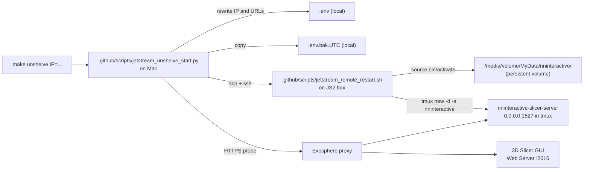

# Reattaching to an unshelved Jetstream2 / MorphoCloud instance

**Driver-side prep** for the heavy GPU tool in [RUNNER_TOPOLOGY.md](RUNNER_TOPOLOGY.md).
Run `make unshelve` from the Mac mini (or any driver machine) — not to install
Slicer/nnInteractive locally, but to refresh proxy URLs and restart services on
Jetstream before scripts like `slicer_remote_bright_seed.py` or `export_session.py`
call `/slicer/exec`.

When the JS2 instance hosting the SlicerNNInteractive stack is shelved and
later unshelved, two things break:

1. **The public IP changes** — the three Exosphere proxy URLs in the local
   `.env` (`JETSTREAM_PUBLIC_IP`, `NNI_REMOTE_URL`, `SLICER_WEBSERVER_URL`)
   all point at the old IP and silently fail.
2. **All processes are gone** — the `nninteractive-slicer-server` FastAPI
   process and (sometimes) the 3D Slicer GUI need to be restarted from
   scratch. The Python venv and the model weights survive because they
   live on `/media/volume/MyData/`.

`make unshelve IP=<new-ip>` automates everything in #1 plus the FastAPI
piece of #2.

## TL;DR

```bash
make unshelve IP=149.165.171.178
```

That's it. It rewrites `.env`, restarts the server on `:1527`, probes both
proxied endpoints, and prints a READY banner with the next-step pilot
command. If the Slicer Web Server on `:2016` is down, it prints a one-line
Python snippet to paste into Slicer's Python Interactor.

## Prerequisites (one-time)

These have to be true *before* `make unshelve` will work. If you're reading
this for the first time after our initial setup, all three are already
satisfied on the production box.

1. **Key-based SSH from your Mac to `exouser@<ip>`** — no password prompts.
   Verify with:
   ```bash
   ssh -o BatchMode=yes -o ConnectTimeout=10 exouser@149.165.171.178 'echo ok'
   ```
   If that hangs or prompts for a password, run `ssh-copy-id exouser@<ip>`
   (after you've successfully logged in once via Guacamole), or pass
   `--ssh-key /path/to/key` to the script.
2. **A working `nninteractive-slicer-server` venv at
   `/media/volume/MyData/nninteractive/`** — this is the persistent volume
   that survives unshelve. The console script
   `/media/volume/MyData/nninteractive/bin/nninteractive-slicer-server`
   must exist. If it doesn't (cold instance), see
   [Cold bootstrap](#cold-bootstrap-deferred-to-v2) below.
3. **`tmux` is installed on the box** — true by default on the JS2 /
   MorphoCloud Ubuntu images. If missing:
   `ssh exouser@<ip> 'sudo apt-get install -y tmux'`.

## What `make unshelve IP=...` actually does



Step by step:

1. **URL building** — from `--ip A.B.C.D` produce
   `https://http-A-B-C-D-1527.proxy-js2-iu.exosphere.app/` and the
   matching `:2016` URL.
2. **SSH preflight** — `ssh -o BatchMode=yes ... 'true'` fails fast with
   an actionable hint if key auth isn't set up.
3. **`.env` rewrite** — backs up to `.env.bak.<UTC>` and replaces the
   active assignments of `JETSTREAM_PUBLIC_IP`, `NNI_REMOTE_URL`, and
   `SLICER_WEBSERVER_URL`. Commented-out documentation lines are left
   alone. Missing keys are appended under a marker header.
4. **Remote restart** — `scp` the bash half to `/tmp/`, then `ssh ... bash
   /tmp/jetstream_remote_restart.sh`. The remote half:
   - Activates `/media/volume/MyData/nninteractive/bin/activate`.
   - Kills any prior `nninteractive` tmux session and stray
     `nninteractive-slicer-server` processes (unless `--reuse-server`).
   - Starts the server in `tmux new -d -s nninteractive ...` so it
     survives SSH disconnect and you can watch logs via
     `tmux attach -t nninteractive` in the Guacamole terminal.
   - Probes `http://127.0.0.1:1527/docs` up to 6× with 5 s backoff before
     declaring success.
5. **HTTPS probes from local** — `GET <NNI_REMOTE_URL>/docs` (and, with
   `--webserver`, `<SLICER_WEBSERVER_URL>/slicer/screenshot`) through the
   Exosphere proxy. Same 6× retry budget.
6. **Slicer Web Server fallback** — if `:2016` is down, the script prints
   the entire contents of
   [`.github/scripts/slicer_start_webserver.py`](../.github/scripts/slicer_start_webserver.py)
   for you to paste into Slicer's Python Interactor (View > Python
   Interactor) inside Guacamole. Press Enter and the script re-probes.
7. **READY banner** — shows both URLs + the suggested 10-click pilot
   command. See "Next: launch the pilot" below.

## Next: launch the pilot

`make unshelve` is the one-and-only Mac-terminal flow that touches
live infra. Once the READY banner prints, **do not** continue with a
local `python eval_project358382_pilot.py …` invocation — the script
has a Darwin guard that refuses, and the cautionary tale is the
2026-05-24 incident (see
[`docs/RUNNER_TOPOLOGY.md`](RUNNER_TOPOLOGY.md#2026-05-24-cautionary-tale-local-pilot-runs-are-forbidden)).

Use the dispatch wrappers instead:

```bash
# Default: 3 specimens, budgets 10,25,50,100 on the Dell GPU runner.
make pilot-dell

# Override anything:
make pilot-dell SPECIMENS=5 BUDGETS=10,25 \
                MANIFEST=Tests/fixtures/jetstream_replay/cached_specimens.json \
                RECORD_TO=Tests/fixtures/jetstream_replay/sessions/today

# Tail the most recent run:
make tail
make tail RUN_ID=<id>
make tail WORKFLOW=eval_project358382_dellgpu.yml

# Once the JS2 GHA runner is registered (Phase 3 of the runner-topology
# rollout), this replaces pilot-dell for runs that should land on the
# Jetstream box `make unshelve` just brought up:
make pilot-jetstream                       # refuses by default until Phase 3
make pilot-jetstream JETSTREAM_PILOT_FORCE=1   # queues the workflow anyway
```

The intent: `make unshelve` brings the JS2 server up. Then either
`make pilot-dell` (today) or `make pilot-jetstream` (after Phase 3)
dispatches the actual pilot via `gh workflow run`. The Mac mini never
runs the pilot itself.

## Common one-off variants

```bash
# Don't restart a server that's already healthy (faster):
make unshelve IP=A.B.C.D UNSHELVE_FLAGS=--reuse-server

# Only restart, don't touch .env (e.g. IP didn't change):
make unshelve IP=A.B.C.D UNSHELVE_FLAGS=--no-env-update

# Show the plan, do nothing destructive:
make unshelve IP=A.B.C.D UNSHELVE_FLAGS=--dry-run

# Non-interactive (CI / scripted): exit non-zero if :2016 is down
# instead of prompting:
make unshelve IP=A.B.C.D UNSHELVE_FLAGS=--non-interactive

# Multiple flags:
make unshelve IP=A.B.C.D UNSHELVE_FLAGS="--reuse-server --non-interactive"
```

You can also call the local script directly to e.g. use a non-default user
or SSH key:

```bash
python3 .github/scripts/jetstream_unshelve_start.py \
    --ip 149.165.171.178 \
    --user exouser \
    --ssh-key ~/.ssh/jetstream_key \
    --nninteractive --webserver
```

## Inside the Guacamole desktop (live logs)

```bash
# Attach to the live server (Ctrl-b d to detach without killing it):
tmux attach -t nninteractive

# Or just tail the file:
tail -f ~/nninteractive_server.log

# Stop the server:
tmux kill-session -t nninteractive
```

## Troubleshooting

| Symptom | Likely cause | Fix |
| --- | --- | --- |
| `SSH to exouser@<ip> failed (exit 255)` | New IP not yet routable, or no key auth | Wait 30 s after unshelve; verify with `ssh -v exouser@<ip>` |
| `venv activator not found: /media/volume/MyData/nninteractive/bin/activate` | Persistent volume not mounted or different path | `ssh exouser@<ip> ls /media/volume/MyData/`; pass `NNI_VENV=...` if it lives elsewhere |
| `:1527 NOT REACHABLE` after restart succeeded | Exosphere proxy slow to refresh after unshelve | Wait 60 s; rerun with `--reuse-server` so it just reprobes |
| `:2016 NOT REACHABLE` | 3D Slicer not running, or Web Server module not started | Open Slicer in Guacamole; paste the snippet the script printed |
| `Server probe returned HTTP 502` | nninteractive-slicer-server bound to `127.0.0.1` instead of `0.0.0.0` | Already handled by the remote script; check `tmux attach -t nninteractive` to see the bind line |

## Cold bootstrap (deferred to v2)

If the instance has *no* nninteractive venv yet (brand-new MorphoCloud
image), `make unshelve` will fail at the venv check. For now, bootstrap
once by hand:

```bash
ssh exouser@<ip>
bash <(curl -fsSL https://raw.githubusercontent.com/.../install_nninteractive_remote.sh)
# then back on the Mac:
make unshelve IP=<ip>
```

A future v2 will add `make unshelve IP=... UNSHELVE_FLAGS=--bootstrap` that
runs [`install_nninteractive_remote.sh`](../.github/scripts/install_nninteractive_remote.sh)
on the box first.

## Deferred to v2 (planned)

- **`--bootstrap`** — first-run install of the venv + model weights.
- **Auto-launch 3D Slicer over SSH** — detect the TurboVNC display and run
  `Slicer --no-splash --python-script slicer_start_webserver.py` so the
  Web Server module comes up without any clicking. Currently the snippet
  has to be pasted into the Python Interactor manually.
- **Auto-load IMPC sample data** — drop the load recipe through
  `/slicer/exec` after the Web Server is up, so the 10-click pilot can
  run end-to-end from a single command.
- **`SlicerMorph/MorphoCloudInstances` PR** — the remote half
  ([`.github/scripts/jetstream_remote_restart.sh`](../.github/scripts/jetstream_remote_restart.sh))
  is intentionally self-contained (no imports from this repo, only tools
  that ship on the default JS2 image) so it can drop into MorphoCloud's
  `/unshelve -nninteractive` add-on as-is. The local half stays here
  because it's tied to this repo's `.env` and pilot scripts.

## Files

| File | Side | Purpose |
| --- | --- | --- |
| [`.github/scripts/jetstream_unshelve_start.py`](../.github/scripts/jetstream_unshelve_start.py) | local Mac | Orchestrator: SSH preflight, `.env` rewrite, drives the remote half, HTTPS probes |
| [`.github/scripts/jetstream_remote_restart.sh`](../.github/scripts/jetstream_remote_restart.sh) | JS2 box | Idempotent tmux + venv launch + loopback probe |
| [`.github/scripts/slicer_start_webserver.py`](../.github/scripts/slicer_start_webserver.py) | Slicer Python Interactor | Start Web Server module on :2016 with Slicer API exec enabled |
| [`Makefile`](../Makefile) (`unshelve` target) | local Mac | `make unshelve IP=...` convenience wrapper |
