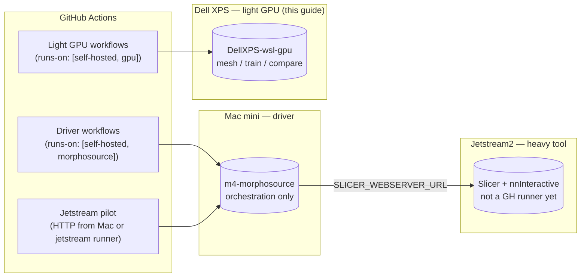

# Self-hosted GPU runner (WSL2 + NVIDIA)

> **Compute planning:** see [RUNNER_TOPOLOGY.md](RUNNER_TOPOLOGY.md). The Mac
> mini runner is a **driver** only. This guide is for the **Dell light-GPU**
> box — mesh work, embeddings, batch nnInteractive compare, and Linux CUDA
> smoke tests. **Interactive Slicer + nnInteractive paint loops** (10-click
> pilot, `export_session` live upgrade) run on **Jetstream2**, driven by HTTP
> from the Mac mini, not by installing Slicer on either desktop.

This guide turns a Windows host with an NVIDIA GPU (e.g. Dell XPS) into a
MorphoClaw self-hosted GitHub Actions runner. The runner lives inside **WSL2
Ubuntu** with **CUDA passthrough**, which means:

* Batch / training workflows (`bootstrap_nninteractive.yml`,
  `nninteractive_compare.yml`, `iterative_segmentation_training.yml`,
  `eval_project358382_dellgpu.yml`) get a real CUDA device instead of
  CPU/MPS on the Mac.
* SlicerMorph (`slicer-integration.yml`) can run headlessly via `xvfb-run`
  on Linux for integration tests.
* The Mac mini (`m4-morphosource`) stays a **driver**: MorphoSource,
  research, and Jetstream HTTP orchestration.

The two hosts coexist by **runner labels** — never use bare `self-hosted`.

## Architecture



Workflows pick the runner by labels:

* `runs-on: [self-hosted, gpu, nninteractive]` — **Dell** light GPU jobs.
* `runs-on: [self-hosted, morphosource]` — **Mac mini** driver.
* `runs-on: self-hosted` — **avoid**; ambiguous and may steal GPU work.
* Live Slicer paint — **Jetstream**, invoked from Mac via `.env` URLs (see
  [JETSTREAM_UNSHELVE.md](JETSTREAM_UNSHELVE.md)).

## Prerequisites

* Windows 10/11 with **virtualization enabled in BIOS** (VT-x / AMD-V).
* An NVIDIA GPU with the **current Studio or GeForce driver** installed
  on Windows. Anything since r495 (Nov 2021) exposes CUDA to WSL2 with
  zero extra config. **Do NOT install NVIDIA drivers inside WSL.**
* ~30 GB free on the system drive (Slicer + nnInteractive weights + a
  bit of headroom).
* A GitHub account with **Maintain** permission on
  `johntrue15/MorphoClaw` (needed to mint a runner registration token).
* Optional: `gh` CLI authenticated on the Windows host — if available,
  the bootstrap can fetch the token automatically.

## Bring-up

### 1. Prepare Windows

From an **elevated** PowerShell prompt at the repo root:

```powershell
powershell -ExecutionPolicy Bypass -File scripts\runners\setup-windows-host.ps1
```

The script:

1. Verifies the NVIDIA driver.
2. Enables `VirtualMachinePlatform` + `Microsoft-Windows-Subsystem-Linux`
   if needed (may require a reboot — the script will say so and exit).
3. Installs WSL2 and `Ubuntu-24.04` if missing.
4. Sets WSL default version to 2.
5. Smoke-tests `nvidia-smi` from inside the new Ubuntu.

If WSL was freshly installed, finish the Ubuntu first-run wizard (set your
UNIX username + password), then re-run the script to confirm everything
is green.

### 2. Install the runner inside WSL

Drop into Ubuntu and run the bootstrap. The repo on the Windows side is
visible at `/mnt/c/...`:

```bash
wsl -d Ubuntu-24.04
bash /mnt/c/Users/<you>/.../MorphoClaw/scripts/runners/setup-wsl-runner.sh
```

The script:

* installs apt prereqs (build tools, `jq`, `xvfb`, the Qt deps Slicer
  needs);
* installs Miniforge into `~/miniforge3` (Python 3.12 + conda);
* downloads the latest `actions/runner` Linux tarball;
* asks for a one-time **runner registration token**. Get one from
  <https://github.com/johntrue15/MorphoClaw/settings/actions/runners/new>
  (or `gh auth login` first and let the script fetch it);
* registers the runner with labels
  `self-hosted, Linux, X64, gpu, cuda, nvidia, wsl, slicer,
  nninteractive, host-<hostname>`;
* writes `<runner>/.env` with `ANACONDA_BIN`, `SLICER_BIN`,
  `NNINTERACTIVE_HOME`, and `PATH` so the existing Mac-shaped
  workflows resolve to Linux paths automatically;
* pre-warms the nnInteractive venv via the repo's own
  `.github/scripts/install_nninteractive.sh`;
* invokes `scripts/runners/install-slicer-linux.sh`, which downloads
  Slicer, drops an `xvfb-run` wrapper at `~/bin/Slicer`, and installs
  SlicerMorph headlessly.

Override anything you want via env vars (see the header comment in each
script).

### 3. Smoke-test the box before connecting it to real jobs

```bash
bash scripts/runners/test-runner.sh
```

The script runs six checks in ~2-3 minutes and exits non-zero on the
first failure:

1. `nvidia-smi` sees the GPU.
2. The actions-runner is configured and its `.env` exports
   `ANACONDA_BIN`, `SLICER_BIN`, `NNINTERACTIVE_HOME`.
3. The nnInteractive venv exists and `import nnInteractive` works.
4. PyTorch reports `torch.cuda.is_available() == True` and a real
   `nnInteractiveInferenceSession(device='cuda')` constructs from the
   weights at `$NNINTERACTIVE_HOME/models/nnInteractive_v1.0`. A
   synthetic 32^3 NIfTI sphere is segmented with a single positive
   point — non-zero output voxels means CUDA inference is fully
   functional, end-to-end.
5. `$SLICER_BIN` launches headlessly under `xvfb-run` and prints a
   version.
6. Inside Slicer, `import GPA` (SlicerMorph) succeeds.

Per-check logs are left in `/tmp/` (`/tmp/gpu_smoke.log`,
`/tmp/gpu_smoke_report.json`, `/tmp/slicer-version.log`,
`/tmp/slicermorph.log`).

### 4. Start the runner

You asked for manual start, so the bootstrap installs **no service**.
Foreground:

```bash
cd ~/actions-runner-morphoclaw
./run.sh
```

The runner stays attached to GitHub until you `Ctrl+C` (or close the WSL
window — WSL will keep the distribution alive for ~60s after the last
process exits unless you `wsl --shutdown`).

### 5. Verify routing + secrets via GitHub

Trigger the **"Runner GPU smoke test"** workflow from the Actions tab
(<https://github.com/johntrue15/MorphoClaw/actions/workflows/runner-smoke.yml>).
It runs the same checks as step 3 but through GitHub Actions, so a
successful green run proves three additional things over the local
smoke test:

* The runner is **online** and GitHub can dispatch jobs to it.
* The `runs-on: [self-hosted, gpu]` **label routing** picks this host.
* The repo's **secrets** flow into the runner's environment (the smoke
  workflow itself doesn't need any, but a successful run gives you the
  greenlight to flip the other GPU-heavy workflows to
  `[self-hosted, gpu]`).

If/when you later want it to come up at boot, run the bundled installer
(it wraps `./svc.sh install` and drops in `Restart=on-failure` so a
crash auto-recovers after 30s):

```bash
bash scripts/runners/install-runner-service.sh
```

Plus a Windows Scheduled Task on the host that keeps WSL itself alive
and starts the service if it's down — installed once with:

```powershell
pwsh scripts\runners\runner-ctl.ps1 watchdog install
```

The watchdog fires every 5 minutes and at logon; together with the
systemd drop-in this gives the runner three nested layers of recovery
(process restart → service restart → host-level wake-up). Day-to-day
status / log inspection still goes through `runner-ctl.ps1` —
`pwsh scripts\runners\runner-ctl.ps1 status` reports both the
systemd-managed and foreground-fallback paths.

> **Caveat:** the Task Scheduler entry runs as the Windows user that
> installed it. If you change Windows accounts, re-run
> `runner-ctl.ps1 watchdog install` from the new account.

## How the workflows find Linux paths

The Mac-mini layout is the historical default for these workflows:

| Var | Mac mini default | WSL runner |
| --- | --- | --- |
| `ANACONDA_BIN` | `/opt/anaconda3/bin` | `/home/<user>/miniforge3/bin` |
| `SLICER_BIN`   | `/Applications/Slicer.app/Contents/MacOS/Slicer` | `/home/<user>/bin/Slicer` (xvfb wrapper) |
| `NNINTERACTIVE_HOME` | `~/.autoresearchclaw/nninteractive` | `~/.autoresearchclaw/nninteractive` |

The five self-hosted workflows have a small early step:

```yaml
- name: Resolve runner-local paths
  shell: bash
  run: |
    ANACONDA_BIN="${ANACONDA_BIN:-/opt/anaconda3/bin}"
    SLICER_BIN="${SLICER_BIN:-/Applications/Slicer.app/Contents/MacOS/Slicer}"
    NNI_HOME="${NNINTERACTIVE_HOME:-$HOME/.autoresearchclaw/nninteractive}"
    echo "ANACONDA_BIN=$ANACONDA_BIN" >> "$GITHUB_ENV"
    echo "SLICER_BIN=$SLICER_BIN"     >> "$GITHUB_ENV"
    echo "NNINTERACTIVE_HOME=$NNI_HOME" >> "$GITHUB_ENV"
    echo "$ANACONDA_BIN" >> "$GITHUB_PATH"
```

Each runner's own `.env` overrides those values for jobs that land on it.
Each runner's own `.env` overrides those values for jobs that land on it.
The WSL host advertises Linux paths through `.env`; the Mac mini should
**not** advertise `gpu` / `nninteractive` / `slicer` if it is driver-only
(see [RUNNER_TOPOLOGY.md](RUNNER_TOPOLOGY.md)).

## Recommended labels on the Mac mini (driver)

Relabel the Mac mini so GPU workflows cannot schedule on it:

```bash
# On the Mac mini:
cd ~/actions-runner-morphosource
./config.sh remove --token <removal-token-from-github>
./config.sh \
  --url    https://github.com/johntrue15/MorphoClaw \
  --token  <fresh-add-token-from-github> \
  --name   m4-morphosource \
  --labels "self-hosted,macOS,ARM64,morphosource,driver" \
  --replace
```

| Workflow `runs-on` | Mac mini (driver) | Dell WSL (light GPU) |
| --- | --- | --- |
| `[self-hosted, gpu, nninteractive]` | no | **yes** |
| `[self-hosted, morphosource]` | **yes** | no |
| `[self-hosted, jetstream]` | no | no (separate JS2 agent when registered) |
| `self-hosted` alone | **avoid** | **avoid** |

## Per-workflow recommendations

| Workflow | Current `runs-on` | Recommended after this PR |
| --- | --- | --- |
| `bootstrap_nninteractive.yml` | `self-hosted` | `[self-hosted, gpu]` once the WSL runner is online |
| `nninteractive_compare.yml` | `self-hosted` | `[self-hosted, gpu]` |
| `iterative_segmentation_training.yml` | `self-hosted` | `[self-hosted, gpu]` |
| `seg_train_live_chameleon.yml` | `self-hosted` | `[self-hosted, gpu]` |
| `slicer-integration.yml` | `self-hosted` | `[self-hosted, slicer]` |
| `autoresearchclaw.yml` | `self-hosted` | leave as `self-hosted` (the agent doesn't always need GPU) |

This PR keeps `runs-on: self-hosted` everywhere so nothing breaks until
both runners are labelled. Flip the GPU-heavy workflows over (one PR,
five line edits) once you've confirmed the WSL runner reliably picks up
jobs and the Mac mini has the new label set.

## Verifying CUDA from inside a workflow

`bootstrap_nninteractive.yml` already prints `nvidia-smi` in its
"Print runner info" step. After the Dell picks the job up you should see
something like:

```text
GPU 0: NVIDIA GeForce GTX 1650 Ti (UUID: GPU-xxxxxxxx-xxxx-xxxx-...)
```

and `install_nninteractive.sh` will detect `nvidia-smi -L` succeeds and
pick the CUDA 12.6 PyTorch wheels (`https://download.pytorch.org/whl/cu126`).

## Troubleshooting

**`nvidia-smi: command not found` inside WSL.** The Windows driver is
either too old or the WSL distro was created before the driver was
installed. Update the Windows driver, then in PowerShell:

```powershell
wsl --shutdown
wsl -d Ubuntu-24.04
nvidia-smi
```

**`Slicer ... Could not connect to display`.** You bypassed the
`~/bin/Slicer` wrapper and called the raw binary. Either use `SLICER_BIN`
set to the wrapper, or wrap manually with
`xvfb-run -a /opt/slicer/Slicer-*/Slicer`.

**`./run.sh` says "Cannot configure the runner under root account".**
Don't run the bootstrap with `sudo`; it runs as your normal user and
escalates only where it has to.

**Runner shows offline minutes after `Ctrl+C`.** This is normal — GitHub
keeps the slot for ~1 minute before marking the runner offline. Restart
with `./run.sh`.

**OneDrive workspace problems.** Don't put the actions-runner inside an
OneDrive-synced folder; OneDrive's reparse-point shenanigans break
`git clone`, hard links and the runner's `_work` directory. The
bootstrap puts everything inside the WSL ext4 filesystem
(`~/actions-runner-morphoclaw`), which sidesteps this entirely.

## Adding more GPU hosts

The bootstrap is intentionally host-agnostic. Repeat the same two-step
flow on any Windows + NVIDIA box (or bare-metal Ubuntu) and the new
host will register as another runner with the same label set. GitHub
will load-balance between them automatically. Use `RUNNER_NAME` /
`RUNNER_LABELS` env vars to differentiate.
