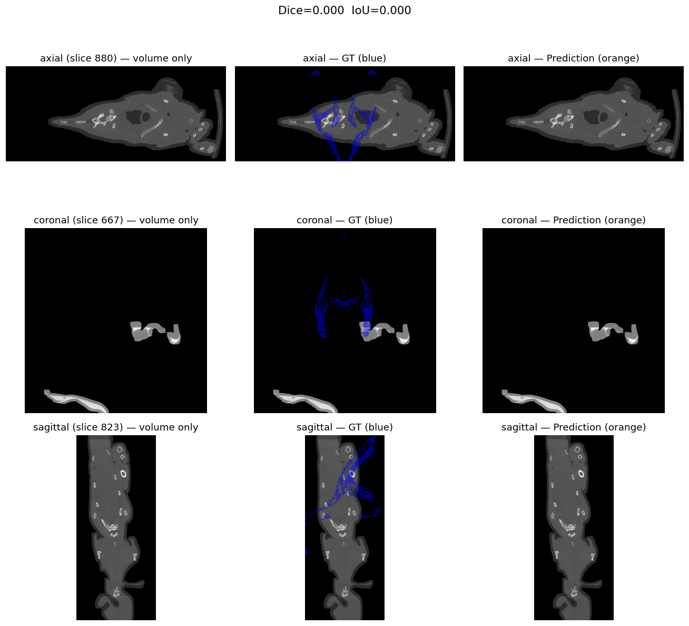

# nnInteractive vs MorphoSource GT — `000408242` vs `000769445`

**Goal:** Segment the cranial bone (skull).  
**Max LLM steps:** 12  
**Steps used:** 1  

## Inputs

- **CT volume:** [`000408242`](https://www.morphosource.org/concern/media/000408242)  
  file: `Z stack` (4,249,246,278 bytes)
- **GT mesh:**  [`000769445`](https://www.morphosource.org/concern/media/000769445)  
  file: `veiled-chameleon-skull-anatomy-000769445.ply` (117,539,838 bytes)

## Voxelization of GT mesh

| Field | Value |
|-------|-------|
| Reference dims | [1682, 731, 1714] |
| Reference spacing (mm) | [0.04978824034333229, 0.04978824034333229, 0.04978824034333229] |
| GT foreground voxels | 21,459,340 |
| GT volume (mm³) | 2648.48 |

## Comparison metrics

| Metric | Value |
|--------|-------|
| Dice | **0.0000** |
| IoU (Jaccard) | 0.0000 |
| Precision | 0.0000 |
| Recall (sensitivity) | 0.0000 |
| Volume diff | 100.00 % |
| Voxels pred / GT | 0 / 21,459,340 |
| Hausdorff (max, mm) | None |
| Hausdorff (95-pct, mm) | None |
| Mean surface distance (mm) | None |
| Centroid distance (mm) | None |

## Visual comparison

Volume only / GT (blue) / Prediction (orange):

## Files

- [`gt_voxelized.nii.gz`](gt_voxelized.nii.gz) — GT mesh rasterized onto the CT grid
- [`nninteractive/000408242_nni_labelmap.nii.gz`](nninteractive/000408242_nni_labelmap.nii.gz) — nnInteractive prediction
- [`metrics.json`](metrics.json) — full metrics payload
- [`nninteractive/000408242_nni_report.md`](nninteractive/000408242_nni_report.md) — paint-loop step trace
